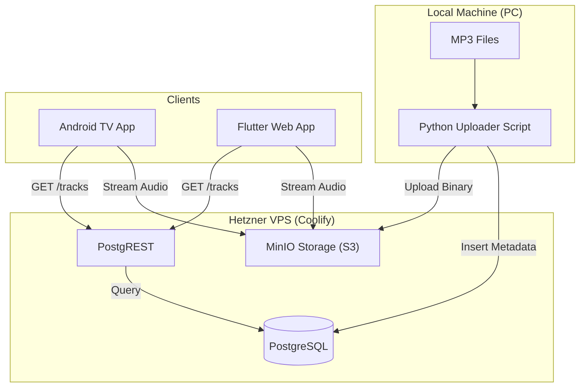

# 🎵 Anywhere-Music-Player

> **Self-hosted, cross-platform music streaming for my personal anime (and more) collection.**
> *Write Once (Flutter), Host Anywhere (Coolify), Play Everywhere (TV & PC).*

**Aniwhere Music Player** is a private streaming solution designed to solve a specific problem: accessing a local high-quality MP3 library (3GB+) seamlessly on a **PC Web Browser** and a **Smart TV (Android TV)** without relying on commercial cloud services.

## 🏗️ Architecture

The system runs entirely on your existing self-hosted infrastructure using **Coolify** on Hetzner.



### The Stack
*   **Infrastructure:** Hetzner Cloud + Coolify.
*   **Storage:** **MinIO** (S3 Compatible) - Stores the MP3 files.
*   **Database:** **PostgreSQL** - Stores song metadata (Artist, Title, Duration, Stream URL).
*   **Ingestion:** **Python Script** - Directly uploads to MinIO and inserts metadata into PostgreSQL.
*   **Read API:** **PostgREST** - Instantly turns the PostgreSQL database into a REST API for the app to read.
*   **Frontend:** **Flutter** - Single codebase compiling to Android TV (APK) and Web (PWA).

---

## 🚀 Prerequisites

1.  **Flutter SDK** installed on your local machine.
2.  **Python 3** installed (for the uploader script).
3.  **Coolify Instance** running with MinIO, PostgreSQL, and PostgREST.

---

## 🛠️ Backend Setup (Coolify)

### 1. Storage (MinIO)
1.  In Coolify, deploy a **MinIO** service.
2.  Create a bucket named `wonderfulmusic`.
3.  **Important:** Set the bucket policy to **Public** (Read-only) so files can be streamed.
4.  Save your `Access Key`, `Secret Key`, and `Endpoint` for the uploader script.

#### Making MinIO Bucket Public via Coolify Terminal

Since you are using Coolify, you can open the **Terminal** tab for your MinIO container and run the command directly there.

**Steps:**

1. **Open the Terminal**
   - Go to Coolify → MinIO Service → **Terminal** → **Connect**

2. **Configure the "Local" Alias**
   ```bash
   mc alias set myminio http://localhost:9000 minio minio123
   ```
   - `myminio`: A nickname for this server
   - `http://localhost:9000`: Connecting to the server from inside the container
   - `minio` / `minio123`: Your root user and password
   - **Note:** If you changed `MINIO_ROOT_PASSWORD` in Coolify, use that instead of `minio123`

3. **Set the Bucket to Public (Read-Only)**
   ```bash
   mc anonymous set download myminio/wonderfulmusic
   ```

4. **Verify the Configuration**
   ```bash
   mc anonymous list myminio/wonderfulmusic
   ```
   - Should output: `readonly` or `download`

Now your audio files are publicly accessible for streaming!

### 2. Database (PostgreSQL)
Run the following SQL in your existing PostgreSQL instance to create the schema:

```sql
CREATE TABLE public.tracks (
    id UUID PRIMARY KEY DEFAULT gen_random_uuid(),
    title TEXT NOT NULL,
    artist TEXT DEFAULT 'Unknown',
    album TEXT,
    filename TEXT NOT NULL UNIQUE,
    stream_url TEXT NOT NULL,
    created_at TIMESTAMP WITH TIME ZONE DEFAULT now()
);

-- Index for faster sorting/searching
CREATE INDEX idx_tracks_artist ON public.tracks(artist);
CREATE INDEX idx_tracks_title ON public.tracks(title);
```

### 3. Read API (PostgREST)
1.  In Coolify, deploy **PostgREST**.
2.  Connect it to your PostgreSQL container.
3.  This will expose your DB at `https://api.YOUR_DOMAIN`.
    *   *Test:* Visiting `https://api.YOUR_DOMAIN/tracks` should return an empty JSON array `[]`.

---

## 📥 Data Ingestion (Python Script)

The uploader script runs on your PC and directly communicates with MinIO and PostgreSQL—no middleware needed.

### Setup

Install dependencies:
```bash
pip install minio psycopg2-binary eyed3
```

### The Uploader Script

**`scripts/upload.py`**:
```python
import os
import eyed3
from minio import Minio
import psycopg2

# CONFIG
FOLDER = r"C:\Music\Anime"
MINIO_ENDPOINT = "minio.YOUR_DOMAIN"
MINIO_ACCESS_KEY = "your-access-key"
MINIO_SECRET_KEY = "your-secret-key"
BUCKET_NAME = "anime-music"

DB_HOST = "YOUR_HETZNER_IP"  # Via SSH tunnel, or direct if exposed
DB_PORT = 5432
DB_NAME = "postgres"
DB_USER = "postgres"
DB_PASS = "your-db-password"

# Initialize clients
minio_client = Minio(
    MINIO_ENDPOINT,
    access_key=MINIO_ACCESS_KEY,
    secret_key=MINIO_SECRET_KEY,
    secure=True
)

db_conn = psycopg2.connect(
    host=DB_HOST, port=DB_PORT,
    dbname=DB_NAME, user=DB_USER, password=DB_PASS
)
db_cursor = db_conn.cursor()

# Process files
for root, _, files in os.walk(FOLDER):
    for file in files:
        if file.endswith(".mp3"):
            path = os.path.join(root, file)
            audio = eyed3.load(path)

            # Extract tags or fallback to filename
            title = audio.tag.title if audio and audio.tag and audio.tag.title else file
            artist = audio.tag.artist if audio and audio.tag and audio.tag.artist else "Unknown"
            album = audio.tag.album if audio and audio.tag and audio.tag.album else None

            print(f"Uploading: {title}...")

            # 1. Upload to MinIO
            minio_client.fput_object(BUCKET_NAME, file, path)

            # 2. Insert metadata into PostgreSQL
            stream_url = f"https://{MINIO_ENDPOINT}/{BUCKET_NAME}/{file}"
            db_cursor.execute(
                """
                INSERT INTO tracks (title, artist, album, filename, stream_url)
                VALUES (%s, %s, %s, %s, %s)
                ON CONFLICT (filename) DO NOTHING
                """,
                (title, artist, album, file, stream_url)
            )
            db_conn.commit()

print("Done!")
db_cursor.close()
db_conn.close()
```

> **Note:** For database access, use an SSH tunnel (`ssh -L 5432:localhost:5432 root@YOUR_IP`) or configure PostgreSQL for secure remote access.

---

## 📺 Frontend Development (Flutter)

The app is built to be "Remote Control Friendly" (D-Pad navigation).

### Project Structure
```text
lib/
├── models/
│   └── track.dart       # JSON model matches Postgres table
├── services/
│   ├── api_service.dart # Dio calls to PostgREST
│   └── audio_player.dart# Just_Audio implementation
├── ui/
│   ├── home_screen.dart # ListView of songs
│   └── player_view.dart # Big 'Now Playing' screen
└── main.dart
```

### Key Dependencies (`pubspec.yaml`)
```yaml
dependencies:
  flutter:
    sdk: flutter
  just_audio: ^0.9.36      # Audio streaming
  dio: ^5.4.0              # HTTP requests
  audio_session: ^0.1.18   # Manage audio focus (TV vs Phone)
  provider: ^6.1.1         # State management
```

### Building & Running

**1. For Web (PC)**
```bash
flutter run -d chrome
```

**2. For Android TV**
*   Connect TV via ADB: `adb connect 192.168.X.X`
*   Run Debug: `flutter run -d android`
*   **Build Final APK:**
    ```bash
    flutter build apk --split-per-abi
    ```
    *Transfer the resulting APK to your TV using the "Send Files to TV" app.*

---

## 🎮 TV Controls

| Remote Button | Action |
| :--- | :--- |
| **D-Pad Up/Down** | Scroll through song list |
| **Center / Select** | Play song |
| **Back** | Return to list (music keeps playing) |

---

## 🔮 Future Roadmap
- [ ] **Favorites:** Add a boolean column to DB and a toggle in UI.
- [ ] **Search:** Implement server-side search via PostgREST (`/tracks?title=ilike.*naruto*`).
- [ ] **Playlists:** Create a separate table for grouping tracks.

---

